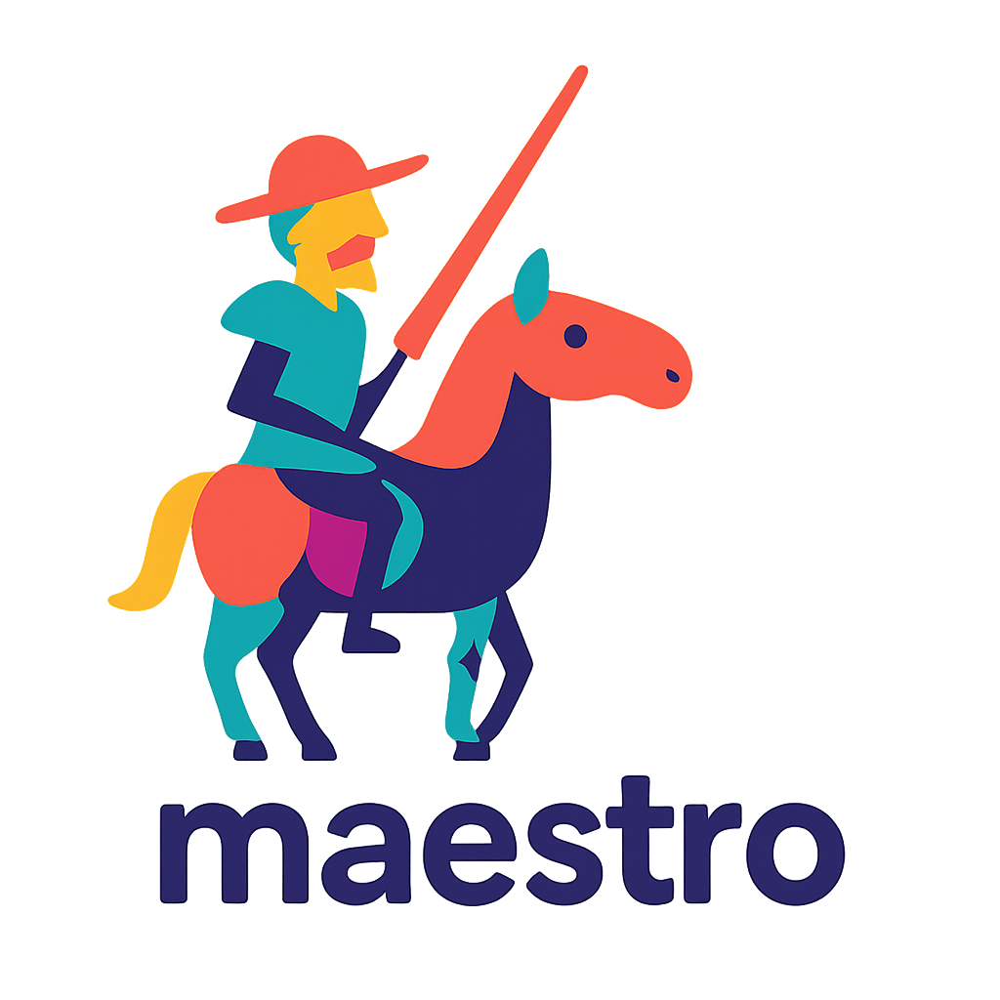
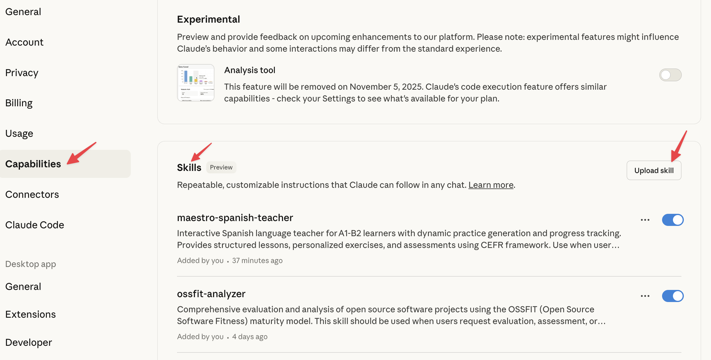

# Maestro - Interactive Spanish Language Teacher

**An intelligent, adaptive Spanish learning Skill for Claude Code**

Version: 1.0.0 | CEFR Levels: A1 → A2 → B1 → B2 

Environment: Claude Desktop app, Claude Web, Claude Code

---

## Overview

Maestro is an interactive Spanish language teacher that transforms Claude Code into your personal language tutor. Unlike traditional language apps with static content, Maestro combines structured curriculum with AI-powered adaptation, using web search to fetch authentic Spanish materials and tracking your progress through spaced repetition algorithms.

### Key Features

- **52-Week Structured Curriculum** - Comprehensive lessons from beginner (A1) to upper-intermediate (B2)
- **AI-Powered Adaptation** - Dynamically adjusts difficulty based on your performance
- **Real-World Content** - Uses web search to fetch authentic Spanish materials (menus, news, rental listings)
- **Progress Tracking** - Spaced repetition, analytics, and personalized weekly reports
- **Interactive Practice** - Role-plays, conversations, and scenario-based learning
- **Regional Awareness** - Learn both Spain Spanish and Mexican/Latin American variants
- **Data-Driven Learning** - Python scripts for vocabulary tracking, progress analysis, and content generation

---

## What Makes Maestro Different

| Traditional Apps | Maestro |
|-----------------|---------|
| Fixed lessons | Adapts to YOUR progress |
| Static content | Live web content |
| Grammar drills | Interactive scenarios |
| One-size-fits-all | Personalized feedback |
| No memory | Spaced repetition tracking |
| Single variant | Spain + Mexico + LA |

---

## Quick Start

### Installation 

### 1. Claude Desktop/Web

Open the setting from Claude Desktop app or from Web and simply upload the skill file **"maestro.skill"**. That's All !




### 2. Claude Code 

```bash
# Navigate to the maestro directory
cd maestro

# Install Python dependencies
pip install -r requirements.txt
# or with uv:
uv pip install -r requirements.txt
```

#### Setup Your Learning Workspace

```bash
# Create your personal learning directory
mkdir -p ~/spanish-learning/{weekly_reports,practice_materials/{news,dialogues,exercises}}

# Copy the progress template
cp maestro/progress_template.md ~/spanish-learning/progress.md
```

### 3. Start Learning

Open Claude Code and say:

```
"我想开始学习西班牙语"
```

or

```
"I want to start learning Spanish"
```

Maestro will automatically activate and begin your initial assessment!

---

## Learning Path

### A1 (Weeks 1-12) - Beginner
- Greetings, introductions, basic conversations
- Present tense verbs, daily routines
- Numbers, time, dates
- **Goal**: Handle basic daily interactions

### A2 (Weeks 13-24) - Elementary
- Past tenses (preterite, imperfect)
- Future tense, comparisons
- Weather, commands, preferences
- **Goal**: Describe experiences and events

### B1 (Weeks 25-40) - Intermediate
- Subjunctive mood (all contexts)
- Conditional, hypotheticals
- Perfect tenses, complex sentences
- **Goal**: Independent communication

### B2 (Weeks 41-52) - Upper Intermediate
- Advanced subjunctive, passive voice
- Idioms, register, style
- Argumentation, nuanced expression
- **Goal**: Fluent, spontaneous, sophisticated communication

---

## Project Structure

```
maestro/
├── SKILL.md                          # Core teaching instructions for Claude
├── README.md                         # This file
├── QUICKSTART.md                     # 5-minute setup guide
├── requirements.txt                  # Python dependencies
├── progress_template.md              # Student progress tracking template
├── maestro.png                       # Project logo
├── curriculum/
│   ├── A1_curriculum.md             # Weeks 1-12 detailed lessons
│   ├── A2_curriculum.md             # Weeks 13-24 detailed lessons
│   ├── B1_curriculum.md             # Weeks 25-40 detailed lessons
│   └── B2_curriculum.md             # Weeks 41-52 detailed lessons
├── teaching_guides/
│   ├── assessment_rubrics.md        # Scoring standards
│   ├── grammar_reference.md         # Quick grammar lookup
│   ├── regional_differences.md      # Spain vs Mexico vs Latin America
│   └── scenarios.md                 # Role-play scenarios
├── scripts/
│   ├── vocab_tracker.py             # Spaced repetition system
│   ├── progress_analyzer.py         # Reports and analytics
│   ├── content_fetcher.py           # Web content retrieval
│   └── practice_generator.py        # Exercise generation
├── resources/
│   └── vocabulary_lists/
│       └── A1_vocabulary.md         # Core 500 words
└── data/                             # (Created during use)
```

---

## How It Works

### Two Main Learning Modes

#### 1. Structured Learning
Follow the 52-week curriculum with daily lessons:
- Say "开始今天的课程" or "继续学习"
- Maestro loads your current week/day from progress.md
- Interactive teaching with practice exercises
- Progress automatically tracked

#### 2. Quick Practice
Practice specific topics on-demand:
- Say "我想练习在餐厅点餐" or "帮我复习subjunctive"
- Maestro adapts to your current level
- Uses web search for authentic materials
- Immediate feedback and corrections

### Daily Lesson Flow (30-45 minutes)

1. **Opening** (5 min) - Review previous lesson
2. **Objectives** (2 min) - Today's goals
3. **Teaching** (10-15 min) - New content with examples
4. **Practice** (20-30 min) - Interactive exercises and role-plays
5. **Closing** (5 min) - Summary and progress update

### Weekly Rhythm

- **Day 1-4**: New content + practice
- **Day 5**: Assessment + regional differences comparison

---

## Unique Features

### Dynamic Web Content
Maestro searches the web for authentic Spanish materials:
- Real restaurant menus (current prices!)
- Actual news articles
- Rental listings
- Social media posts
- Cultural events

### Spaced Repetition System
Built-in vocabulary tracking with spaced repetition algorithm:
```bash
# Check words due today
python scripts/vocab_tracker.py --due-today

# Add new words
python scripts/vocab_tracker.py --add "estar,ubicación,emoción"

# View statistics
python scripts/vocab_tracker.py --stats
```

### Regional Spanish Variations
Learn both Spain and Mexico/Latin American Spanish:
- Vocabulary differences: "ordenador" (Spain) vs "computadora" (Mexico)
- Grammar: "vosotros" (Spain) vs "ustedes" (Mexico/LA)
- Pronunciation patterns
- Cultural context

### Comprehensive Assessments
Every 5th day includes assessment:
- Grammar, vocabulary, fluency, comprehension
- Detailed feedback with specific examples
- Track progress over time
- Advance when ready (3 consecutive assessments ≥80/100)

---

## Expected Timeline

**Casual learner** (3-4 sessions/week, 30-45 min each):
- A1 completion: ~3-4 months
- A2 completion: ~6-8 months
- B1 completion: ~12-15 months
- B2 completion: ~18-24 months

**Intensive learner** (daily sessions, 1 hour each):
- A1 completion: ~6-8 weeks
- A2 completion: ~3-4 months
- B1 completion: ~6-8 months
- B2 completion: ~10-12 months

---

## Python Scripts

### Vocabulary Tracker (`scripts/vocab_tracker.py`)
Manages spaced repetition for vocabulary learning:
- Tracks when words need review
- Adjusts intervals based on performance
- Generates review lists
- Provides mastery statistics

### Progress Analyzer (`scripts/progress_analyzer.py`)
Analyzes learning patterns and generates reports:
- Weekly progress reports
- Identifies weaknesses and patterns
- Predicts level advancement
- Visualizes learning curve

### Content Fetcher (`scripts/content_fetcher.py`)
Retrieves authentic Spanish content from the web:
- News articles (simplified to level)
- Restaurant menus
- Rental listings
- Social media content

### Practice Generator (`scripts/practice_generator.py`)
Creates customized exercises:
- Fill-in-the-blank
- Translation practice
- Conjugation drills
- Mixed exercises targeting weaknesses

---

## Teaching Philosophy

1. **Interactive, not passive** - Constant dialogue, not lectures
2. **Spiral learning** - Assess → Plan → Teach → Test → Feedback → Repeat
3. **Practical focus** - Real-world usage over academic grammar
4. **Data-driven** - Track progress, identify patterns, optimize
5. **Authentic materials** - Current, real Spanish content
6. **Cultural competence** - Language + culture together

---

## Tips for Success

### Do's
- Practice consistently (even 20 min/day is better than 3 hours once/week)
- Speak out loud during practice
- Review vocabulary daily using spaced repetition
- Ask questions when confused
- Embrace mistakes as learning opportunities
- Use Spanish outside lessons (music, movies, apps)

### Don'ts
- Don't rush through lessons just to "finish"
- Don't skip assessments (they identify gaps)
- Don't fear making errors in practice
- Don't compare your pace to others
- Don't study only grammar without speaking

---

## B2 Achievement Goals

Upon completing B2, you will be able to:
- Interact fluently with native speakers
- Understand complex texts and implicit meanings
- Participate in professional meetings
- Write sophisticated essays and reports
- Function independently in Spanish-speaking environment
- **Live, work, or study in Spain/Latin America!**

---

## Language Usage

- **Your questions → Maestro answers**: 中文 (Chinese)
- **Grammar explanations**: 中文
- **Teaching content**: 西语 + 英语 for clarity
- **Example sentences**: 西语 + 英语
- **Your practice**: 西语 (Spanish)
- **Corrections**: 西语 + 中文 explanation

---

## Requirements

- **Claude Code** - This skill is designed specifically for Claude Code environment
- **Python 3.7+** - For helper scripts
- **Internet connection** - For fetching authentic web content
- **Git** - For version control and updates

Python dependencies:
- requests
- beautifulsoup4
- markdownify
- python-dateutil
- pyyaml

---

## Getting Help

### During Sessions
- Ask Maestro: "我有个问题..."
- Request clarification: "请再解释一遍"
- Ask for examples: "给我一些例子"

### Technical Issues
- Check [QUICKSTART.md](maestro/QUICKSTART.md) for setup help
- Verify `~/spanish-learning/progress.md` exists and is writable
- Ensure Python dependencies are installed

---

## Version History

### v1.0.0 (November 2025)
- Initial release
- Complete A1-B2 curriculum (52 weeks)
- Four Python helper scripts
- Progress tracking and spaced repetition
- Regional variations support (Spain, Mexico, LA)
- Web content integration
- Interactive assessment system

---

## Credits

**Created by**: Joe (with Claude's assistance)
**Framework**: CEFR (Common European Framework of Reference for Languages)
**Methodology**: Communicative language teaching, spaced repetition research
**For**: Personal use and learning

---

## Let's Begin!

**"El viaje de mil millas comienza con un paso."**
*(The journey of a thousand miles begins with one step.)*

Open Claude Code and say:

```
"Hola, Maestro. 我准备好学习西班牙语了！"
```

¡Vamos! Let's go! 加油！

---

*Maestro - Your personal Spanish teacher, powered by AI* 🤖🇪🇸
